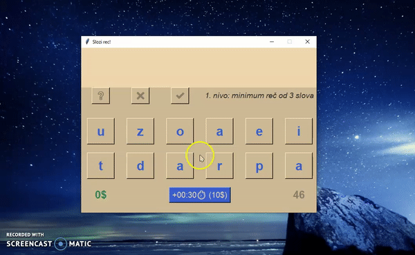

# WordGame

## Demo:

 
## **_A mini desktop game that tests the logic and skill of folding words._**
- The player's job is to design a word from given letters within a given time.
- The required length of the word is increased at each level
- The game has 6 levels:
Level 1 = a word of at least 3 letters
Level 2 = a minimum of 4 letters
Level 3 = a minimum of 5 letters
Level 4 = a minimum of 6 letters
Level 5 = a minimum of 7 letters
Level 6 = a minimum of 8 letters
- For every word the player makes, he wins $ depending on the length of the word
- The player can spend $ on extra time if he needs it

### Instructions
-Clicking the letters that are displayed on the screen, the player creates a word 
-There are 4 options available to the player: 
- BUTTON |?| - colors the word: 
green -> if it exists in the dictionary 
orange -> if it exists in the dictionary, but it is not long enough 
red -> if the word does not exist in the dictionary 

- BUTTON |X| - clears the whole word

- BUTTON |✔| - confirm

- BUTTON |+00:30| - extends the time for 30 seconds

-In each level, the timer is counting 60 seconds (if the player does not extend the time)

### Notes
- When the user creates a word it is checked in the dictionaries that are in .txt format and are located in the project folder
- I have found the dictionary in the e-format on the Internet, which means that it's not a complete dictionary, lots of words are missing
- I divided the dictionary into 12 txt files according to the length of the words, so that every time, when checking, the app doesn't have to search the entire dictionary with all the words,
but only with that length of the word the player has made (for example, if the player folds a word of 6 letters, that word is searched in the recnik_6.txt file)
- The app has a preset combinations of the letters so that a sufficiently long word can be made at each level
- Letters combinations are random each time, there are currently only 20 combinations
- I did not pay much attention to conventions for naming variables, methods, classes, etc., it was made for a student project
- GUI is made with Tkinter

### Language
-Serbian

### Credis ------------------ 
Goran Rakic, for the e-dictionary that I used
https://github.com/grakic/hunspell-sr/blob/master/sr-Latn.dic
